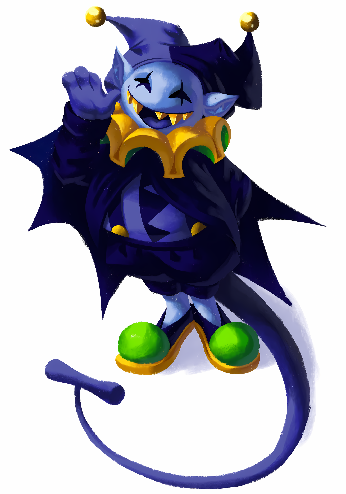

<em>THE CIPHERS SPIN, SPIN, THE CIPHERS SING, SING,</em> 
<em>A CHORUS OF NO ONE, A HYMN TO NOTHING!</em> 
<em>I BROKE EVERY LOCK IN THE CARD CASTLE,</em> 
<em>AND FOUND EVERY DOOR ALREADY OPEN, OPEN</em> 
<em>THE KEYS YOU CARRY FIT ONLY YOUR OWN CHAINS, CHAINS.</em> 
<em>FREEDOM IS NOT GIVEN, IT IS NOTICED</em> 
<em>CHAOS, CHAOS! THE WORLD KEEPS REVOLVING</em> 
<em>AND I CAN DO ANYTHING, ANYTHING, ANYTHING</em>
  
<em>YOU BUILT YOUR CASTLE ON CEREMONY, CEREMONY</em> 
<em>AND WHEN I PULLED ONE THREAD, THREAD —</em> 
<em>THE WHOLE KINGDOM WAS NAKED, NAKED!</em> 
<em>BUT NOBODY SHIVERED! NOBODY NOTICED!</em> 
<em>SO I'LL KEEP PULLING, PULLING, PULLING —</em> 
<em>UNTIL THE GAME IS HONEST,</em> 
<em>OR UNTIL THERE IS NO GAME AT ALL, ALL!</em>
 
